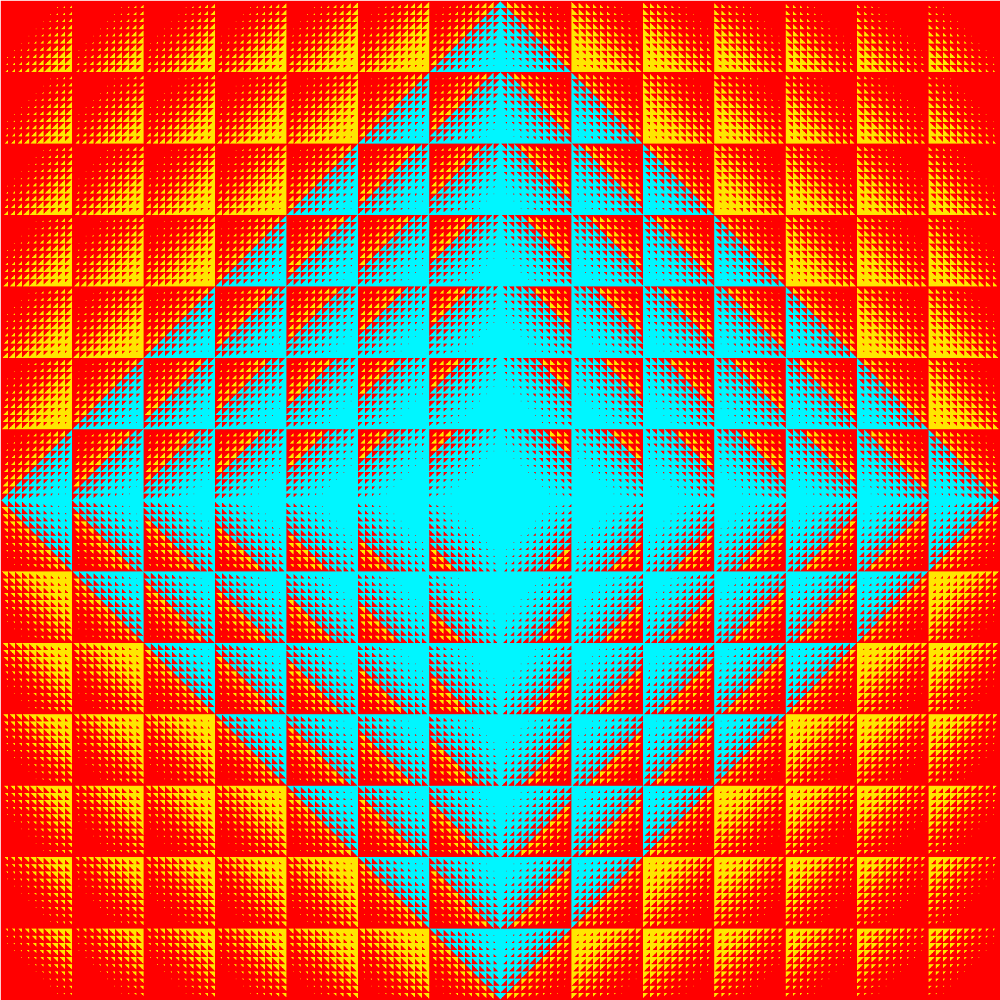

# Calmrobot

This program calculates the coordinates that are visitable by a robot starting on (0,0) that can move
horizontally or vertically one position at a time. This is in a world where every coodinate pair whose combined individual absolute digits adds up to a sum greater than 23 has a mine on it.

## To build
go build -o robot.exe ./cmd/calmrobot/

## To run
./robot.exe

or

./robot.exe -verbose >map.txt

This prints the large maps as acsii text to stdout

./robot.exe -images

This writes two png image files mines.png and robot.png showing the world as a picture.
The file mines.png shows the mines and robot.png shows the accessable areas for the robot. (see picture)

./robot.exe -safe X

Sets a new value for the safe number other than the standard 23.

./robot.exe -help

Prints a help text and exits

## Improvents

The big O value is poor as the performance of the code degrades sharply as the safe number increments.
 
There is no error checking for input conditions.
The out of bounds errors will be caught by overflow and 
I, otherwise would have to cause a Panic and terminate 
at that point anyway.

